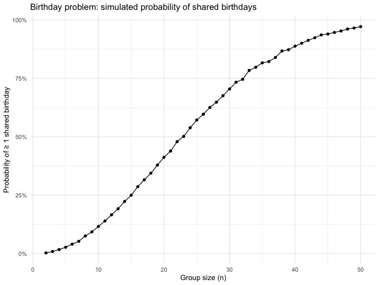

p8105_hw5_yl5828
================
Leah Li
2025-11-14

### Problem 0

#### Create the required function to check if there are any duplicate birthdays.

``` r
birthday_sim <- function(n_people) {
  birthdays <- sample(1:365, size = n_people, replace = TRUE)
  any(duplicated(birthdays))
}
```

#### Repeat the function 10000 times and compute and probablity that at least two people in the group will share a birthday.

``` r
set.seed(1)

sim_results <- 
  tibble(group_size = 2:50) %>% 
  mutate(
    sim_outcomes = map(group_size, ~ replicate(10000, birthday_sim(.x))),
    prob_shared  = map_dbl(sim_outcomes, mean)
  )
```

#### Creae a plot to show the results.

``` r
ggplot(sim_results, aes(x = group_size, y = prob_shared)) +
  geom_line() +
  geom_point() +
  scale_y_continuous(labels = scales::percent_format(accuracy = 1)) +
  labs(
    x = "Group size (n)",
    y = "Probability of ≥ 1 shared birthday",
    title = "Birthday problem: simulated probability of shared birthdays"
  ) +
  theme_minimal()
```


