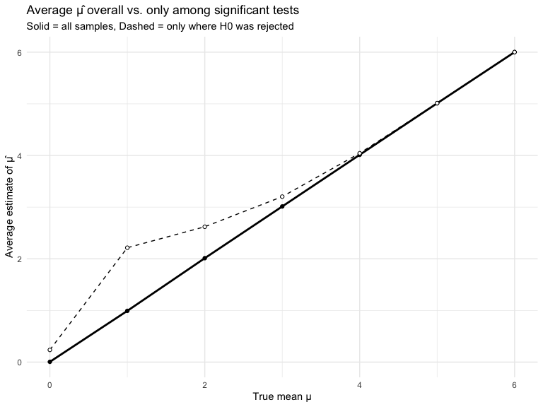

p8105_hw5_yl5828
================
Leah Li
2025-11-14

### Problem 1

#### Create the required function to check if there are any duplicate birthdays.

``` r
birthday_sim <- function(n_people) {
  birthdays <- sample(1:365, size = n_people, replace = TRUE)
  any(duplicated(birthdays))
}
```

#### Repeat the function 10000 times and compute and probablity that at least two people in the group will share a birthday.

``` r
set.seed(1)

sim_results <- 
  tibble(group_size = 2:50) %>% 
  mutate(
    sim_outcomes = map(group_size, ~ replicate(10000, birthday_sim(.x))),
    prob_shared  = map_dbl(sim_outcomes, mean)
  )
```

#### Creae a plot to show the results.

``` r
ggplot(sim_results, aes(x = group_size, y = prob_shared)) +
  geom_line() +
  geom_point() +
  scale_y_continuous(labels = scales::percent_format(accuracy = 1)) +
  labs(
    x = "Group size (n)",
    y = "Probability of ≥ 1 shared birthday",
    title = "Q1: Simulated Probability of Shared Birthdays"
  ) +
  theme_minimal()
```


#### Comment on the plot:

The curve shows an exponential-like growth, rapidly increasing from
near-zero probability with small groups to near-certainty with larger
groups. The simulation shows that with just 23 people, there’s
approximately a 50% chance that two people share a birthday. With 30
people, the probability rises to about 70%. With 40 people, the
probability exceeds 90%. With 50 people, the probability is nearly 97%.

### Problem 2

#### Define parameters

``` r
n     <- 30
sigma <- 5
mu_vals <- 0:6  
n_sims <- 5000
```

#### Create a function to generate one dataset and run one-sample t-test.

``` r
sim_one <- function(mu, n = 30, sigma = 5) {
  x <- rnorm(n, mean = mu, sd = sigma)
  
  t.test(x, mu = 0) |>
    tidy() |>
    transmute(
      mu_hat  = estimate,
      p_value = p.value
    )
}
```

#### Run the simulation of 5000 datasets for each mu value

``` r
sim_results <- map_dfr(mu_vals, function(mu) {
  tibble(
    mu_true = mu,
    sim_id  = 1:n_sims
  ) |>
    mutate(
      res = map(sim_id, ~ sim_one(mu))
    ) |>
    unnest(cols = res)
})

head(sim_results)
```

    ## # A tibble: 6 × 4
    ##   mu_true sim_id mu_hat p_value
    ##     <int>  <int>  <dbl>   <dbl>
    ## 1       0      1 -1.62   0.0545
    ## 2       0      2 -0.542  0.569 
    ## 3       0      3 -0.278  0.767 
    ## 4       0      4 -0.303  0.733 
    ## 5       0      5  0.406  0.637 
    ## 6       0      6  0.147  0.881

#### Plot1: Power vs. effect size

``` r
power_df <- sim_results %>%
  group_by(mu_true) %>%
  summarize(
    power = mean(p_value < 0.05),
    .groups = "drop"
  )

ggplot(power_df, aes(x = mu_true, y = power)) +
  geom_line() +
  geom_point() +
  labs(
    x = "True mean μ",
    y = "Power (Pr reject H0: μ = 0)",
    title = "Power of one-sample t-test (n = 30, σ = 5)"
  ) +
  theme_minimal()
```


#### Comment:

Power is about 0.05 when μ = 0 (just the type I error rate). As the true
mean moves farther from 0 (larger effect size), power increases rapidly
and approaches 1 by μ around 5–6. So larger effect sizes leads to higher
power.

#### Plot2: Average Estimates vs. True mu

``` r
mu_summary <- sim_results %>%
  group_by(mu_true) %>%
  summarize(
    mean_mu_hat_all    = mean(mu_hat),
    mean_mu_hat_reject = mean(mu_hat[p_value < 0.05]),
    .groups = "drop"
  )

mu_summary
```

    ## # A tibble: 7 × 3
    ##   mu_true mean_mu_hat_all mean_mu_hat_reject
    ##     <int>           <dbl>              <dbl>
    ## 1       0         0.00500              0.236
    ## 2       1         0.992                2.21 
    ## 3       2         2.01                 2.62 
    ## 4       3         3.01                 3.20 
    ## 5       4         4.01                 4.04 
    ## 6       5         5.01                 5.01 
    ## 7       6         6.00                 6.00

``` r
ggplot(mu_summary, aes(x = mu_true)) +
  geom_line(aes(y = mean_mu_hat_all), linewidth = 1) +
  geom_point(aes(y = mean_mu_hat_all)) +
  geom_line(aes(y = mean_mu_hat_reject), linetype = "dashed") +
  geom_point(aes(y = mean_mu_hat_reject), shape = 21, fill = "white") +
  labs(
    x = "True mean μ",
    y = "Average estimate of μ̂",
    title = "Average μ̂ overall vs. only among significant tests",
    subtitle = "Solid = all samples, Dashed = only where H0 was rejected"
  ) +
  theme_minimal()
```



#### Comment:

The solid line (all samples): Falls perfectly on the 45° diagonal line,
showing that μ̂ is an unbiased estimator of μ across all samples The
dotted line (only rejected nulls): Shows overestimation when power is
low (small effect sizes), then converges to the true value as power
increases

### Problem 3

#### Read in dataset

``` r
url <- "https://raw.githubusercontent.com/washingtonpost/data-homicides/master/homicide-data.csv"

homicides <- read_csv(url)
```

    ## Rows: 52179 Columns: 12
    ## ── Column specification ────────────────────────────────────────────────────────
    ## Delimiter: ","
    ## chr (9): uid, victim_last, victim_first, victim_race, victim_age, victim_sex...
    ## dbl (3): reported_date, lat, lon
    ## 
    ## ℹ Use `spec()` to retrieve the full column specification for this data.
    ## ℹ Specify the column types or set `show_col_types = FALSE` to quiet this message.

#### Create variable and sum totals and counts

``` r
homicides_city <- homicides %>%
  mutate(
    city_state = str_c(city, ", ", state),
    is_unsolved = disposition %in% c("Closed without arrest", "Open/No arrest")
  )

city_summary <- homicides_city %>%
  group_by(city_state) %>%
  summarize(
    total = n(),
    unsolved = sum(is_unsolved),
    .groups = "drop"
  )

city_summary
```

    ## # A tibble: 51 × 3
    ##    city_state      total unsolved
    ##    <chr>           <int>    <int>
    ##  1 Albuquerque, NM   378      146
    ##  2 Atlanta, GA       973      373
    ##  3 Baltimore, MD    2827     1825
    ##  4 Baton Rouge, LA   424      196
    ##  5 Birmingham, AL    800      347
    ##  6 Boston, MA        614      310
    ##  7 Buffalo, NY       521      319
    ##  8 Charlotte, NC     687      206
    ##  9 Chicago, IL      5535     4073
    ## 10 Cincinnati, OH    694      309
    ## # ℹ 41 more rows

#### Estimate and CI for Baltimore

``` r
baltimore <- city_summary %>%
  filter(city_state == "Baltimore, MD")

baltimore
```

    ## # A tibble: 1 × 3
    ##   city_state    total unsolved
    ##   <chr>         <int>    <int>
    ## 1 Baltimore, MD  2827     1825

``` r
baltimore_prop <- prop.test(
  x = baltimore$unsolved,
  n = baltimore$total
)

baltimore_tidy <- tidy(baltimore_prop)
baltimore_tidy
```

    ## # A tibble: 1 × 8
    ##   estimate statistic  p.value parameter conf.low conf.high method    alternative
    ##      <dbl>     <dbl>    <dbl>     <int>    <dbl>     <dbl> <chr>     <chr>      
    ## 1    0.646      239. 6.46e-54         1    0.628     0.663 1-sample… two.sided

``` r
baltimore_estimate <- baltimore_tidy %>% pull(estimate)
baltimore_ci_low   <- baltimore_tidy %>% pull(conf.low)
baltimore_ci_high  <- baltimore_tidy %>% pull(conf.high)

baltimore_estimate
```

    ##         p 
    ## 0.6455607

``` r
baltimore_ci_low
```

    ## [1] 0.6275625

``` r
baltimore_ci_high
```

    ## [1] 0.6631599

#### Run the same for every city

``` r
city_results <- city_summary %>%
  mutate(
    prop_test = map2(unsolved, total, ~ prop.test(.x, .y)),
    prop_tidy = map(prop_test, tidy)
  ) %>%
  unnest(prop_tidy)

city_results
```

    ## # A tibble: 51 × 12
    ##    city_state    total unsolved prop_test estimate statistic   p.value parameter
    ##    <chr>         <int>    <int> <list>       <dbl>     <dbl>     <dbl>     <int>
    ##  1 Albuquerque,…   378      146 <htest>      0.386   19.1    1.23e-  5         1
    ##  2 Atlanta, GA     973      373 <htest>      0.383   52.5    4.32e- 13         1
    ##  3 Baltimore, MD  2827     1825 <htest>      0.646  239.     6.46e- 54         1
    ##  4 Baton Rouge,…   424      196 <htest>      0.462    2.27   1.32e-  1         1
    ##  5 Birmingham, …   800      347 <htest>      0.434   13.8    2.05e-  4         1
    ##  6 Boston, MA      614      310 <htest>      0.505    0.0407 8.40e-  1         1
    ##  7 Buffalo, NY     521      319 <htest>      0.612   25.8    3.73e-  7         1
    ##  8 Charlotte, NC   687      206 <htest>      0.300  109.     1.41e- 25         1
    ##  9 Chicago, IL    5535     4073 <htest>      0.736 1231.     1.28e-269         1
    ## 10 Cincinnati, …   694      309 <htest>      0.445    8.11   4.41e-  3         1
    ## # ℹ 41 more rows
    ## # ℹ 4 more variables: conf.low <dbl>, conf.high <dbl>, method <chr>,
    ## #   alternative <chr>

#### Plot the estimates with CIs for each city

``` r
city_results %>%
  mutate(
    city_state = fct_reorder(city_state, estimate)
  ) %>%
  ggplot(aes(x = city_state, y = estimate)) +
  geom_point() +
  geom_errorbar(aes(ymin = conf.low, ymax = conf.high), width = 0.2) +
  coord_flip() +
  labs(
    x = "",
    y = "Proportion of homicides unsolved",
    title = "Estimated proportion of unsolved homicides by city",
    subtitle = "95% confidence intervals from prop.test"
  ) +
  theme_minimal()
```


